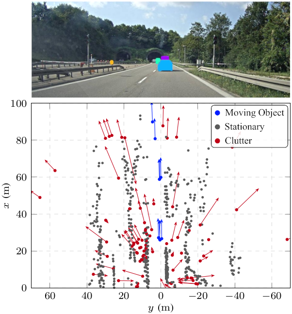

# Radar Clutter Data Set

## About

This repository contains a script for automatic label generation for a radar clutter data set, i.e. a data set in which clutter detections are annotated. It takes the public [RadarScenes](https://radar-scenes.com) data set and generates new ground-truth for it.

The three classes distinguished in the new annotations are *moving object*, *stationary* and *clutter*. The former two identify detections that represent real moving and nonmoving objects (including the ground), respectively. All other detections are clutter.



### Citation

The label generation method was first presented in the (not yet published) paper **"Tackling Clutter in Radar Data -- Label Generation and Detection Using PointNet++"** by J. Kopp, D. Kellner, A. Piroli and K. Dietmayer. Please cite this paper when using the generated ground-truth in your own work.
<!-- This creates a collapsed block: 
<details><summary>BibTeX</summary>
TODO
</details>
-->

## Instructions

### Prerequisites

* A working Python installation, version >=3.6
* A current version of pip (upgrade via `python3 -m pip install --upgrade pip`)

### Generating the radar clutter data set

***NOTE: The label generation method's code will be published as soon as the submitted paper is accepted! Until then, these instructions are only for demonstration.***

1. **Download the original RadarScenes data set** from [https://zenodo.org/record/4559821](https://zenodo.org/record/4559821) and extract the zip file. For the remainder of these instructions, it assumed that the extracted data is stored in `~/workspace/RadarScenes_Clutter/`. However, you may replace this with a path of your choice.

2. **Install the [RadarScenes utility Python package](https://github.com/oleschum/radar_scenes).** This can be done e.g. in a newly created virtual environment as follows.\
    On Linux:
    ```shell
    python3 -m venv ~/.virtualenvs/radar_scenes_venv  # create a virtual Python environment named "radar_scenes_venv"
    source ~/.virtualenvs/radar_scenes_venv/bin/activate  # activate the environment
    python3 -m pip install radar_scenes
    ```
    On Windows:
    ```shell
    python3 -m venv %HOMEPATH%\.virtualenvs\radar_scenes_venv  # create a virtual Python environment named "radar_scenes_venv"
    %HOMEPATH%\.virtualenvs\radar_scenes_venv\Scripts\activate.bat  # activate the environment
    python3 -m pip install radar_scenes
    ```
    For a more detailed description of the installation, see [https://github.com/oleschum/radar_scenes#installation](https://github.com/oleschum/radar_scenes#installation).

3. **Download the script for label generation provided in this repository.** There are multiple ways to do this. You can either clone the entire git repository (assuming git is installed on your system) via
    ```shell
    git clone https://github.com/kopp-j/clutter-ds.git /path/for/storing/script/  # target directory may e.g. be ~/clutter_dataset_generation/
    ```
    or download the repository as a zip file from [https://github.com/kopp-j/clutter-ds/archive/refs/heads/main.zip](https://github.com/kopp-j/clutter-ds/archive/refs/heads/main.zip) and extract it locally
    
    or copy the code of the two [source files](https://github.com/kopp-j/clutter-ds/tree/main/src) directly.

4. **Execute the label generation script**
    ```shell
    # Navigate to the directory in which the label generation script is stored
    cd /path/for/storing/script/  # or ~/clutter_dataset_generation/ or any other path you chose in step 3
    
    # Execute the script from within the virtual environment (if necessary, reactivate the environment as seen in step 2)
    python3 ./src/generate_clutter_labels.py --dataset-path ~/workspace/RadarScenes_Clutter/
    ```
    After confirming that the original data set files may be overwritten, you will see the script processing the sequences one by one. The entire execution may take several minutes, depending on your system.

Once the script's execution is completed, the finished radar clutter data set is available in the directory `~/workspace/RadarScenes_Clutter/`. Since the original storage format is maintained, all code intended for the RadarScenes data set will also work with the new data. Only the [label definition](https://github.com/kopp-j/clutter-ds/blob/main/src/clutter_labels.py) has to be adapted.

## Citation

See [above](https://github.com/kopp-j/clutter-ds#citation).
